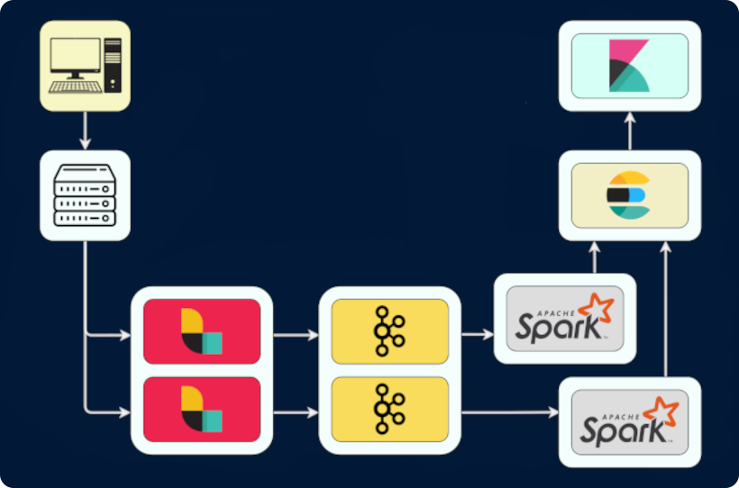
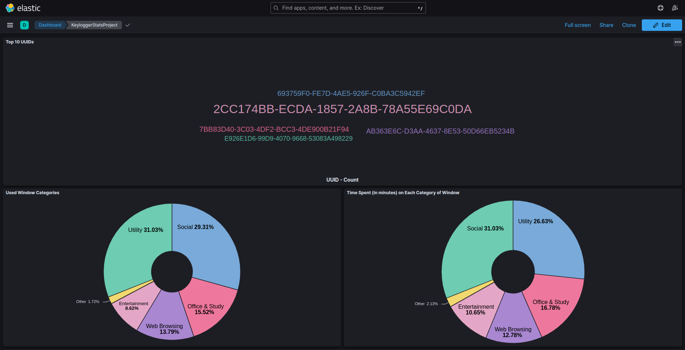
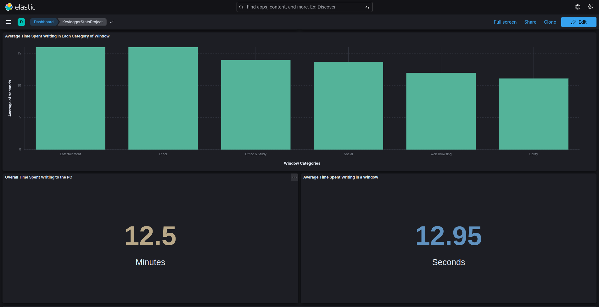
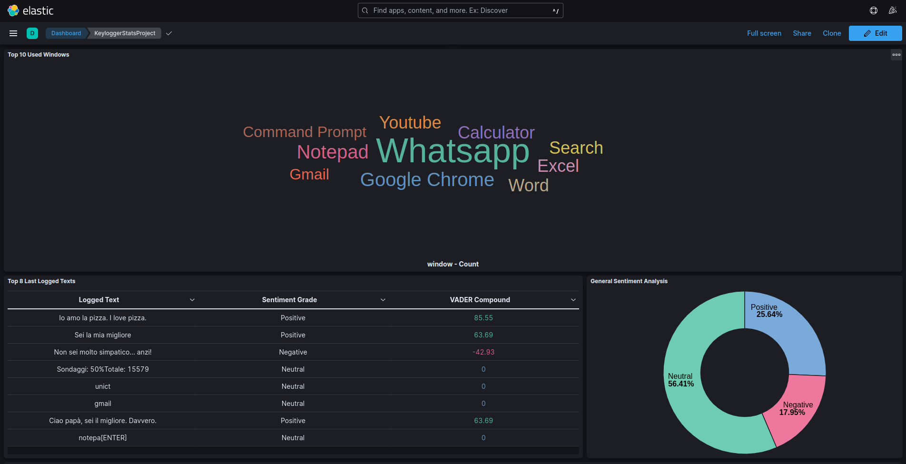
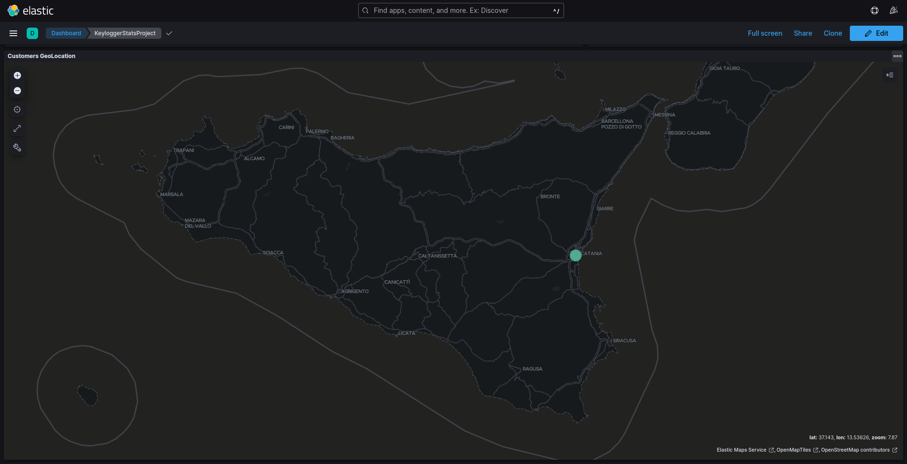
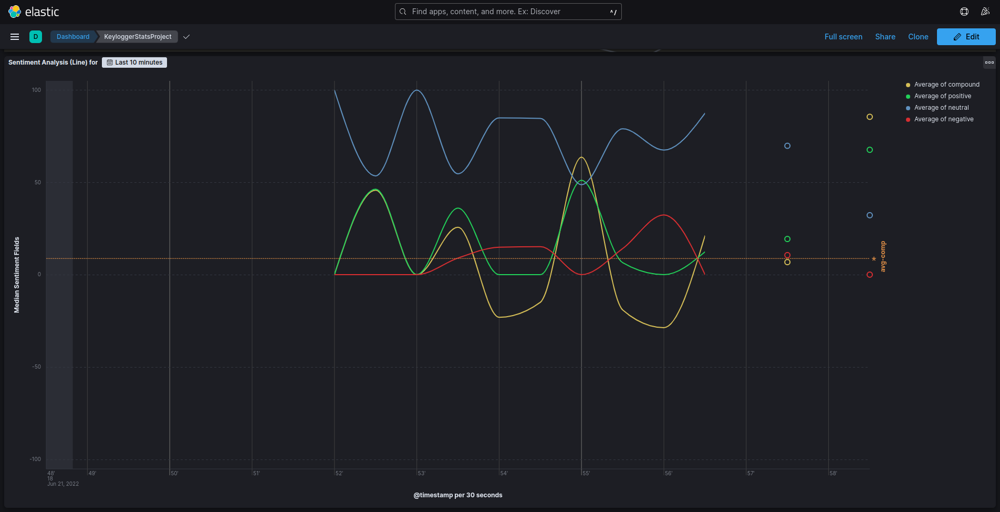

# Systems-Stats-By-Keylogger
_Project of Technologies for Advanced Programming_<br/>
_Grade: 30 with honors / 30_<br/>
_Antonio Scardace_ @ _Dept of Math and Computer Science, University of Catania_

[](https://www.codefactor.io/repository/github/antonioscardace/systems-stats-by-keylogger/overview/main)

## Introduction

This project was created as an exam project, to test and practice the following skills:
* Knowledge of Docker
* Knowledge of Data Ingestion via Logstash
* Knowledge of Data Streaming via Kafka
* Knowledge of Data Processing via Spark 
* Knowledge of Data Storing via Elasticsearch
* Knowledge of Data Visualization via Kibana

## Real Use Case

The project aims to make stats on the real-time use of the system by the users who use a product.

It can be useful as:
1. System Monitor owned by **Operating Systems**' owners
2. **Parental Control**
3. **Spyware**

### Data Source: Keylogger

The data source is a Keylogger which sends logs to the **TCP** server probably on foreground window change.

The log has the following **JSON** pattern:
```
{
   "uuid": "UUID...",
   "window-title": "Window Title...",
   "timestamp-start": "Timestamp of Start...",
   "log-text": "Logged Text...",
   "timestamp-end": "Timestamp of End...",
   "ip-address": "IP Address..."
}
```

Each log is composed by:
- **UUID**: Identifies the PC univocally. It has 128 bits.
- **Window Title**: Is the title of the window where the user has typed.
- **Timestamp of Start**: Indicates when the user started typing in that window.
- **Logged Text**: Is the set of keys pressed by the user.
- **Timestamp of End**: Indicates when the user finished typing in that window.
- **IP Address**: Is the public IP address. If the PC has no connection, the default value is "Unknown".

For instance:
```
{
   "uuid": "154A9DC6-FF4E-4149-B81C-610AE7BBD151",
   "window-title": "Whatsapp",
   "timestamp-start": "2022-01-01 12:05:17",
   "log-text": "Hi Nicole, happy new year!![ENTER]",
   "timestamp-end": "2022-01-01 12:05:41",
   "ip-address": "1.2.3.4"
}
```

### Server System

Receives logs (from multiple clients) and passes them to the pipeline illustrated below:
<p align="center">  </p>

The following functions are available for each user (personal stats) and for all users (general stats):
- For Logged Text:
    + Top 8 Last Logged Texts :page_facing_up:
    + Sentiment analysis :chart_with_upwards_trend:
- For Metadata:
    + Top 10 most used applications :bookmark:
    + Used windows (heuristic) classification :bar_chart:
        * Social
        * Utility
        * Entertainment
        * Web Browsing
        * Office & Study
        * Other
    + Customers Geolocation by IP :earth_americas:
    + Different stats about time spent writing to the PC :eyes:

## Structure

Let's see the structure of the project and how I have used all the components. <br/>
Each component used in this project has been put inside a **Docker Container** :whale:

You can find some screen of what each container prints in ``/docs/snaps/``.

Component | Description
------ | -------
 | I have used it to implement a multi-threading server that receives real-time logs via TCP requests on the 8800 port from multiple clients. For each request, it extracts the features from the log, and saves all into two CSV files. <br/><br/> **metadata.csv** = [*UUID, Window Title, Timestamp of Begin, Timestamp of End, IP Address*] <br/> **logs.csv** = [*UUID, Logged Text*]
 | I have used **Logstash** to create two different dataflows: one for the metadata and one for the text logs. Logstash takes this input data from the two CSV files.
 | I have used **Apache Kafka** to make a single cluster, which has two topics: one for logs and one for metadata. It receives two different dataflows by Logstash and stores them to be pulled by Spark Streaming. Note that **Kafka Stream** has not been used.
 | There are two Docker Containers - one for each Kafka Topic we need to read from. Both of them, after the processing, save the documents into the Elasticsearch index *keylogger_stats*. <br/><br/> In the first, **Spark Streaming** reads data from the _logs_ topic and adds a little set of features. Specifically, it is the VADER dictionary. <br/> In the second, **Spark Streaming** reads data from the _metadata_ topic and adds three features: the class label of the window, the difference (in seconds) between the two timestamps fields, and the public IP address geolocation coordinates (if it isn't set to "Unknown"). <br/>
 | I have used **Elasticsearch** to create a cluster, containing the *keylogger_stats* index, shared only by a single node: *es001*. It receives docs from Spark Streaming. Data are saved into a Docker Volume to make the application persistent in time.
 | I have used **Kibana** to visualize some stats in real-time - I have set the dashboard auto-refresh to happen every second. The dashboard analyses just the data that arrived in the last 24 hours (you can change the time range). It shows general data (of all PCs) and if the user clicks on a specific UUID, the dashboard shows data of that specific PC.

## Demo







## Getting Started

So that the repository is successfully cloned and project run smoothly, a few steps need to be followed.

### Requisites

* A stable internet connection is required.
* A good amount of free space (few GBs) is required.
* Use of Linux, MacOS, or Windows WSL.
* Need to download and install [Docker](https://docs.docker.com/get-docker/) (but the use of [Docker Desktop](https://www.docker.com/products/docker-desktop/) is optional).
* The use of [Visual Studio Code](https://code.visualstudio.com/download) is strongly recommended.

### Installation and Use

```sh
   $ git clone https://github.com/antonioscardace/Systems-Stats-By-Keylogger.git
   $ cd YOUR_PATH/Systems-Stats-By-Keylogger/
   $ bash run.sh
``` 

### Useful Links

Container | URL | Description
----- | ------- | -------
broker | http://localhost:8080 | UI for Kafka
elasticsearch | [http://localhost:9200/keylogger_stats/_...](http://localhost:9200/keylogger_stats/_search?source_content_type=application/json&source={%22query%22:{%22match%22:{%22type%22:%22log%22}}}) | ElasticSearch URL to get all logs
elasticsearch | [http://localhost:9200/keylogger_stats/_...](http://localhost:9200/keylogger_stats/_search?source_content_type=application/json&source={%22query%22:{%22match%22:{%22type%22:%22metadata%22}}}) | ElasticSearch URL to get all metadata
kibana | http://localhost:5601 | Kibana basic URL
kibana | [http://localhost:5601/dashboards/list?...](http://localhost:5601/app/dashboards#/list?_g=(filters:!(),refreshInterval:(pause:!f,value:1000),time:(from:now-24h%2Fh,to:now))) | Kibana Dashboards List

## License :copyright: 

**Author**: [Antonio Scardace](https://linktr.ee/antonioscardace). <br/>
Distributed under the **GNU General Public License v3.0**. See ``` LICENSE ``` for more information.

PLEASE USE AND READ IT FOR ACADEMIC PURPOSES ONLY. :bangbang: <br/>
I DISCLAIM ANY LIABILITY FOR ILLEGAL USE. :bangbang:
